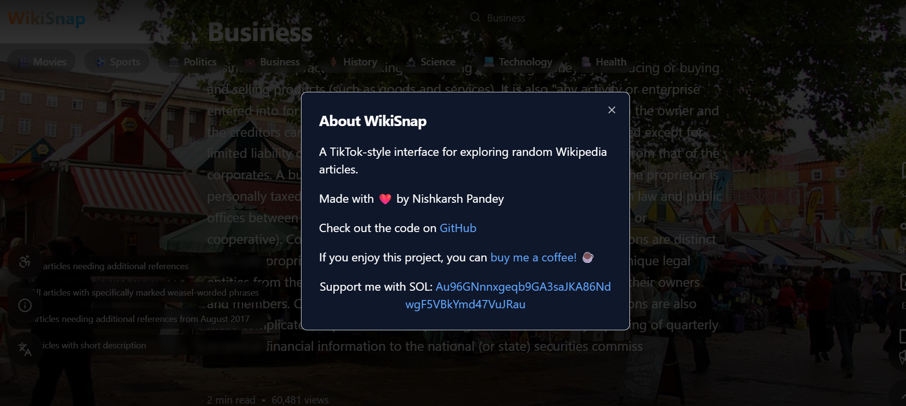
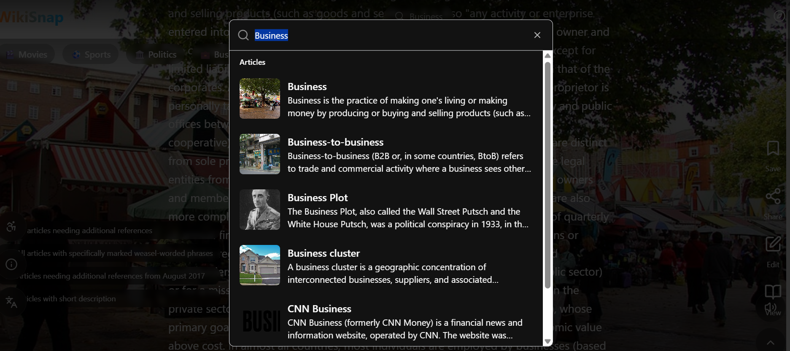
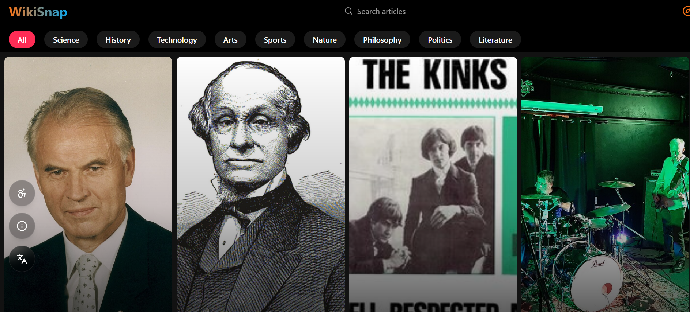

# Project Title
📚 **WikiSnap**
WikiSnap is a unique mashup of Wikipedia and Snapchat/TikTok — designed to bring quick, engaging, and bite-sized summaries of Wikipedia articles in a visually appealing, scrollable format.
Think: Wikipedia knowledge meets the speed and style of Snapchat/TikTok.

## Features
- 📚 Snap-Worthy Content: Quickly view summaries of Wikipedia articles.
- 🎞️ Interactive Story Format: Experience content like a scrolling story.
- ✨ User-Friendly Design: Intuitive UI for easy exploration.
- 🎨 Customizable Interface: Personalize your experience with themes.
- 🔍 Smart Search & Explore: Find topics and dive into articles.
-📄 Auto-fetch summaries using the Wikipedia API.
-🧠 Minimal distraction, swipe/tap interface like TikTok or Snapchat.
-📱 Mobile-friendly and responsive design.

## 🔧 Tech Stack
- **Frontend**:  TypeScript,Tailwind CSS
- **API**: Wikipedia API
- **Deployment**: Vercel
- **Hosting**: Vercel
- **LowCode**: Lovable

## 🛠️ Installation

1. Clone the repository
```
git clone https://github.com/Nish2005karsh/WikiSnap.git
cd WikiSnap
```
2. Install dependencies
```bash
npm install
```
3. Run the project
```bash
npm start
```
4. Enjoy the app 🎉

## 📸Screenshots





## How to Use
1. Enter a topic or search query.
2. Tap the "Search" button.
3. Browse through the results.

## 🧠 How It Works
User enters a keyword/topic.
WikiSnap fetches the summary from Wikipedia using its API.
The summary is styled and displayed in a "snap" — fast and readable.
Swipe/scroll to discover more!

## 🚀 Badges


[](https://wiki-snap.vercel.app/)

## ✅ Future Ideas
Text-to-speech.
Trending topic highlights.
Dark mode.
Save/share snaps.

## 📄 License
This project is licensed under the MIT License.


## Contact
Contact
Created by Nishkarsh - feel free to reach out via GitHub issues or email for questions, suggestions, or feedback

## Contributing
Contributing
Feel free to fork the repository and submit pull requests for any improvements or additional features. If you encounter bugs or have suggestions, open an issue and we’ll look into it!
If you'd like to improve WikiSnap:
Fork the repository
Create a new branch (git checkout -b feature-name)
Make your changes
Commit your work (git commit -m 'Add some feature')
Push to the branch (git push origin feature-name)
Open a Pull Request
Feel free to open issues for suggestions or bugs!

## ⭐ Support the Project
If you find this tool helpful, please give it a star! It helps the project gain visibility and shows your support.